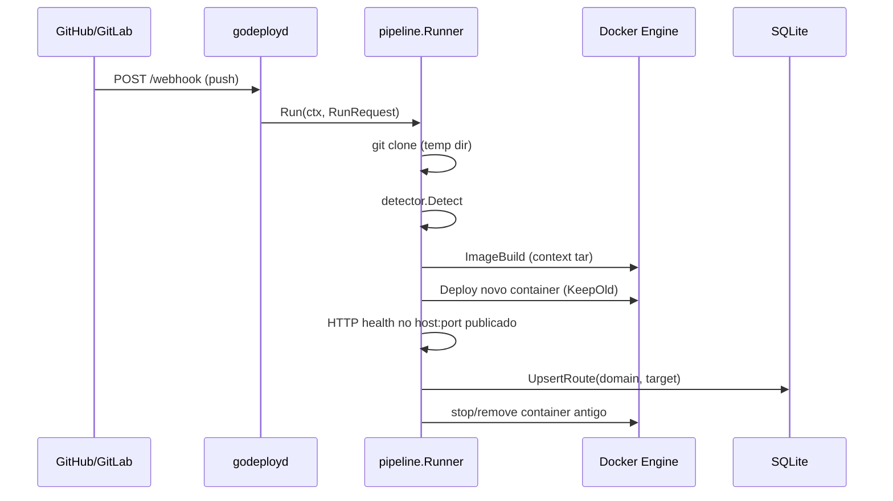

# Arquitetura (visão resumida)

## Fluxo de deploy (webhook)

## Componentes

- **godeployd** compõe middleware de segurança, rate limit no webhook, parser de eventos e um `pipeline.Runner` com cliente Docker e `sql.DB` partilhado.
- **pipeline** é o orquestrador: isolamento em diretório temporário, build com streaming de logs para `slog`, rollout com healthcheck antes de trocar rota.
- **proxy** mantém um mapa `Host` → `ip:port` em memória, recarregado por versão em `proxy_meta` e notificação opcional após deploy.
- **scheduler** garante a rede bridge etiquetada `godeploy.managed`, publica portas e aplica limites de recurso.

## Endurecimento HTTP e dados (daemon)

- **`godeployd`**: `ReadHeaderTimeout` e `ReadTimeout` no `http.Server` para leitura do pedido; `WriteTimeout` omitido para handlers longos (webhook) e upgrade WebSocket; `MaxBytesReader` no corpo do webhook.
- **SQLite**: pool conservador via `internal/platform/sqlpool` (`MaxOpenConns(1)`, `ConnMaxLifetime`) em daemon e TUI.
- **Middleware**: headers de segurança incluindo `Cache-Control: no-store` nas respostas do mux principal.

## Decisões

- **SQLite** embutido (sem servidor) para simplicidade em estudo; não substitui um control plane distribuído.
- **internal/** deixa explícito que não há compromisso de API pública entre versões.
- **WebSocket**: `CheckOrigin` restritivo; mesma origem e lista opcional via env.
- **TLS**: terminação fora do processo Go (ver [deployment.md](deployment.md)).
