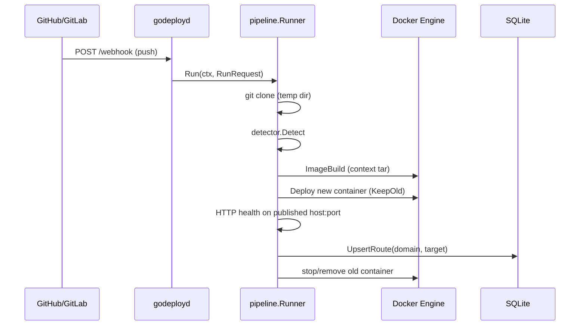

# Architecture (high-level)

## Deploy flow (webhook)

## Components

- **godeployd** wires security middleware, webhook rate limiting, event parsing, and a `pipeline.Runner` with a shared Docker client and `sql.DB`.
- **pipeline** orchestrates: isolation in a temp directory, build with log streaming to `slog`, rollout with health check before switching routes.
- **proxy** keeps an in-memory `Host` → `ip:port` map, reloaded by version in `proxy_meta` and optional notification after deploy.
- **scheduler** ensures the bridge network labelled `godeploy.managed`, publishes ports, and applies resource limits.

## HTTP hardening and data (daemon)

- **`godeployd`**: `ReadHeaderTimeout` and `ReadTimeout` on `http.Server` for request reads; `WriteTimeout` omitted for long handlers (webhook) and WebSocket upgrade; `MaxBytesReader` on the webhook body.
- **SQLite**: conservative pooling via `internal/platform/sqlpool` (`MaxOpenConns(1)`, `ConnMaxLifetime`) in daemon and TUI.
- **Middleware**: security headers including `Cache-Control: no-store` on the main mux responses.

## Decisions

- **Embedded SQLite** (no server process) for simplicity in a learning setup; not a distributed control plane.
- **internal/** makes it explicit there is no stable public API between releases.
- **WebSocket**: restrictive `CheckOrigin`; same origin and optional list via env.
- **TLS**: termination outside the Go process (see [deployment.md](deployment.md)).
